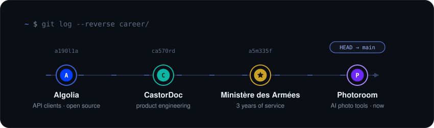
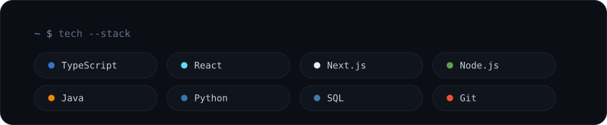
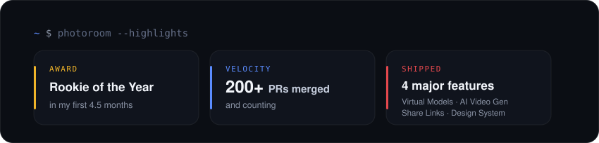

 main)" />

<picture>
  <source media="(prefers-color-scheme: dark)" srcset="https://raw.githubusercontent.com/TomKlotzPro/TomKlotzPro/output/minesweeper-contribution-graph-dark.svg" />
  
</picture>

<code>déminage en cours — chaque case est une contribution</code>

  

&nbsp;&nbsp;

  

🇫🇷 Made in Paris · <code>liberté, égalité, déployé</code>

